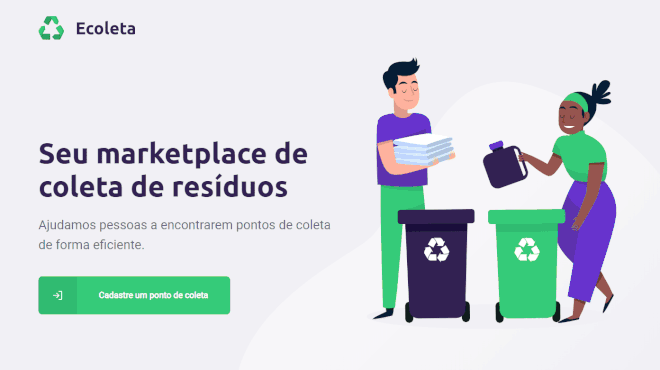
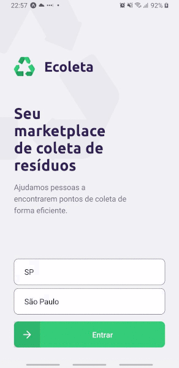

<!-- PROJECT LOGO -->
<br />
<p align="center">
    <h1 align="center">
        
    </h1>

<p align="center">
  <a href="#projeto">Projeto</a>&nbsp;&nbsp;&nbsp;|&nbsp;&nbsp;&nbsp;
  <a href="#tecnologias">Tecnologias</a>&nbsp;&nbsp;&nbsp;|&nbsp;&nbsp;&nbsp;
  <a href="#preview-web">Preview</a>&nbsp;&nbsp;&nbsp;|&nbsp;&nbsp;&nbsp;
  <a href="#instalação">Instalação</a>&nbsp;&nbsp;&nbsp;|&nbsp;&nbsp;&nbsp;
  <a href="#licença">Licença</a>&nbsp;&nbsp;&nbsp;|&nbsp;&nbsp;&nbsp;

</p>

## Ecoleta

[![MIT License][license-shield]][license-url] [![LinkedIn][linkedin-shield]][linkedin-url] [![Linguagens][github-lang-shield]][github-lang-url]

### Projeto

Este projeto foi desenvolvido durante a semana Next Level Week ministrada pela RocketSeat. O Ecoleta é um marketplace que ajuda pessoas a encontrarem pontos de coleta de resíduos de forma eficiente.

### Tecnologias

Esse projeto foi desenvolvido com as seguintes tecnologias:

- [Node.js](https://nodejs.org/en/)
- [TypeScript](https://www.typescriptlang.org/)
- [React](https://reactjs.org)
- [React Native](https://facebook.github.io/react-native/)
- [Expo](https://expo.io/)


### Preview Web

<p align="center">
    
</p>

### Preview Mobile

<p align="center">
    
</p>

### Instalação 

#### Obter os arquivos

```bash
$ git clone https://github.com/pauloabq/nlw-ecoleta.git

```

#### Back-end

Instalação

```bash
# Acessar o diretório do projeto, e depois no server
$ cd nlw-ecoleta\server\
$ npm install
```

Migrations - criação do banco SqLite e tabelas:

```bash
$ npm run knex:migrate
```

Seed - alimentar uma tabela de itens de coleta:

```bash
$ npm run knex:seed
```

Iniciar servidor

```bash
$ npm run dev
```

Definir o valor da variável de ambiente para desenvolvimento **.env.dev**

#### Front-end

```bash
# Acessar o diretório do projeto, e depois \web
$ cd nlw-ecoleta\web\
$ npm install
```

Iniciando

```bash
$ npm start
```

#### Mobile

```bash
# Acessar o diretório do projeto, e depois no \mobile
$ cd nlw-ecoleta\mobile\
$ npm install
```

Definir os endpoints de APIs em **mobile\config\environment.ts**

Iniciando:

```bash
$ npm start
```

### Licença

Esse projeto está sob a licença MIT. Veja o arquivo [LICENSE](LICENSE) para mais detalhes.

### Contato

<strong>Paulo Albuquerque</strong>

[![Twitter][twitter-shield]][twitter-url] [![LinkedIn][linkedin-shield]][linkedin-url] [![GitHub][github-profile-shield]][github-profile-url]


<!-- MARKDOWN LINKS & IMAGES -->
<!-- https://www.markdownguide.org/basic-syntax/#reference-style-links -->
[license-shield]: https://img.shields.io/github/license/pauloabq/nlw-ecoleta
[license-url]: https://github.com/pauloabq/nlw-ecoleta/blob/master/LICENSE

[twitter-shield]: https://img.shields.io/badge/-twitter-black.svg?style=flat-square&logo=twitter&colorB=555
[twitter-url]: http://twitter.com/pauloabq

[github-profile-shield]: https://img.shields.io/badge/-Github-black?style=flat-square&logo=github&colorB=555
[github-profile-url]: http://github.com/pauloabq

[linkedin-shield]: https://img.shields.io/badge/-LinkedIn-black.svg?style=flat-square&logo=linkedin&colorB=555
[linkedin-url]: https://linkedin.com/in/pauloabq


[github-lang-shield]: https://img.shields.io/github/languages/count/pauloabq/nlw-ecoleta
[github-lang-url]: http://github.com/pauloabq
